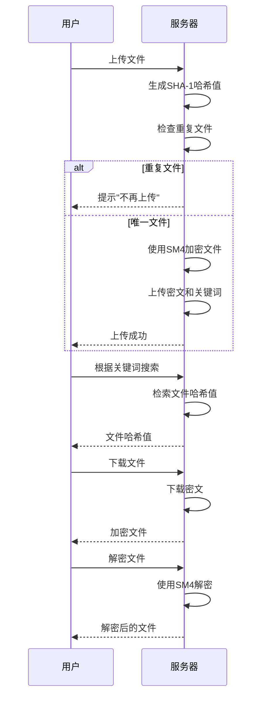

# EFRS
Implementation of encrypted file retrieval system
# 题目1：加密文件检索系统的实现  
+ 具体要求：  
在网络存储应用中，为了节省存储空间，通常会对重复数据进行消除操作。本题目致力于设计和实现一个加密文件的检索系统，其中要求密文上传需执行重复性检测，采用SHA-1算法对文件进行哈希运算，哈希值作为加密的密钥，用户文件采用国密SM4对称密码加密上传至服务器；同时利用SHA-1算法对文档关键字生成搜索符，一并上传。当上传重复数据时，服务器提示不上传；用户可以利用关键字对数据下载并执行解密操作。通过本课题使学生深入了解密码学在机密性、重复性检测等领域的实现原理，提升编程能力。
题目的具体要求如下：
+ (1)	查阅相关资料，掌握密文去重、检索算法的原理和实现细节；熟悉SM4算法、Hash算法等基本的密码算法的实现；
+ (2)	选择一种编程语言和开发工具，设计和实现密文检索系统，对不同类型、不同大小的文件进行重复性验证，对不同的关键字执行检索，分析比较检测的准确率、执行效率等指标；
+ (3)	对涉及的密钥体现管理的细节；数据来自于不同的用户，服务器方对数据的存储、检索进行合理的设计；
+ (4)	程序具有图形化用户界面，输出美观；
+ (5)	可根据自己能力，在完成以上基本要求后，对程序功能进行适当扩充；
+ (6)	撰写报告，对所采用的算法、程序结构和主要函数过程以及关键变量进行详细的说明；对程序的调试过程所遇到的问题进行回顾和分析，对测试和运行结果进行分析；总结软件设计和实习的经验和体会，进一步改进的设想；
+ (7)	提供关键程序的清单、源程序及可执行文件和相关的软件说明。

