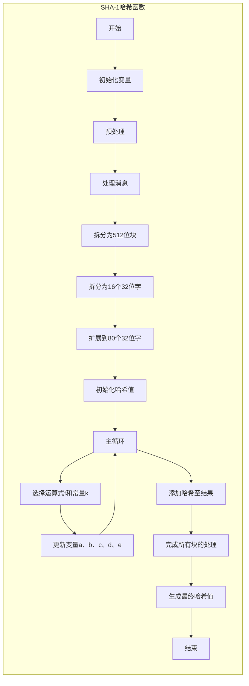

```mermaid
graph BT
subgraph SHA-1哈希函数
    A[开始]
    B[初始化变量]
    C[预处理]
    D[处理消息]
    E[拆分为512位块]
    F[拆分为16个32位字]
    G[扩展到80个32位字]
    H[初始化哈希值]
    I[主循环]
    J[选择运算式f和常量k]

    L["更新变量a、b、c、d、e"]
    M[添加哈希至结果]
    N[完成所有块的处理]
    O[生成最终哈希值]
    P[结束]

    A --> B
    B --> C
    C --> D
    D --> E
    E --> F
    F --> G
    G --> H
    H --> I
    I --> J
    J --> L
    L --> I
    I --> M
    M --> N
    N --> O
    O --> P
end


```
