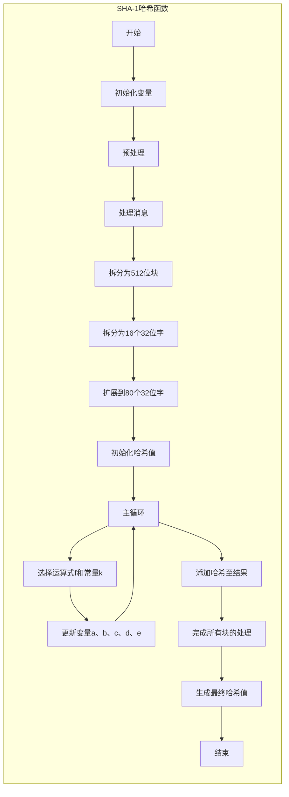

```bash
SHA-1（英语：Secure Hash Algorithm 1，中文名：安全散列算法1）是一种密码散列函数，美国国家安全局设计，并由美国国家标准技术研究所（NIST）发布为联邦资料处理标准（FIPS）[3]。SHA-1可以生成一个被称为消息摘要的160位（20字节）散列值，散列值通常的呈现形式为40个十六进制数。
2005年，密码分析人员发现了对SHA-1的有效攻击方法，这表明该算法可能不够安全，不能继续使用[4]，自2010年以来，许多组织建议用SHA-2或SHA-3来替换SHA-1[5][6][7]。Microsoft[8]、Google[9]以及Mozilla[10][11][12]都宣布，它们旗下的浏览器将在2017年停止接受使用SHA-1算法签名的SSL证书。
2017年2月23日，CWI Amsterdam与Google宣布了一个成功的SHA-1碰撞攻击[13][14]，发布了两份内容不同但SHA-1散列值相同的PDF文件作为概念证明。[15]
2020年，针对SHA-1的选择前缀冲突攻击已经实际可行。建议尽可能用SHA-2或SHA-3取代SHA-1。[16][17]
```



