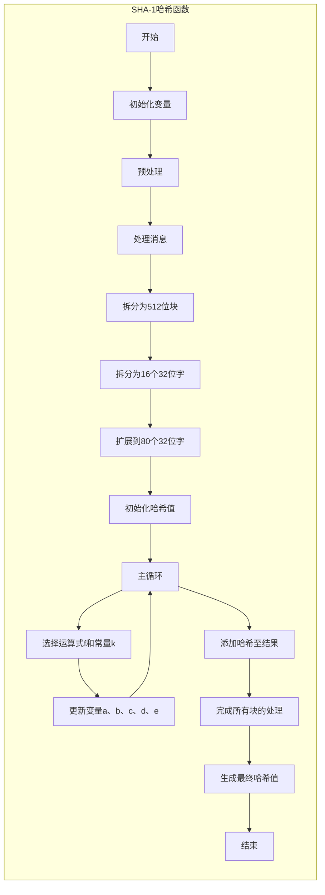

```bash
SHA-1（英语：Secure Hash Algorithm 1，中文名：安全散列算法1）是一种密码散列函数，美国国家安全局设计，并由美国国家标准技术研究所（NIST）发布为联邦资料处理标准（FIPS）。SHA-1可以生成一个被称为消息摘要的160位（20字节）散列值，散列值通常的呈现形式为40个十六进制数。
2005年，密码分析人员发现了对SHA-1的有效攻击方法，这表明该算法可能不够安全，不能继续使用，自2010年以来，许多组织建议用SHA-2或SHA-3来替换SHA-1。Microsoft、Google以及Mozilla都宣布，它们旗下的浏览器将在2017年停止接受使用SHA-1算法签名的SSL证书。
2017年2月23日，CWI Amsterdam与Google宣布了一个成功的SHA-1碰撞攻击[13][14]，发布了两份内容不同但SHA-1散列值相同的PDF文件作为概念证明。[15]
2020年，针对SHA-1的选择前缀冲突攻击已经实际可行。建议尽可能用SHA-2或SHA-3取代SHA-1。
```
== SHA-1演算法 ==
以下是SHA-1演算法的[[伪代码]]：
 <span style="color: green;">''Note: All variables are unsigned 32 bits and wrap modulo 2<sup>32</sup> when calculating''</span>

 <span style="color: green;">''Initial variables:''</span>
 h0 := 0x67452301
 h1 := 0xEFCDAB89
 h2 := 0x98BADCFE
 h3 := 0x10325476
 h4 := 0xC3D2E1F0

 <span style="color: green;">''Pre-processing:''</span>
 append the bit '1' to the message
 append k bits '0', where k is the minimum number >= 0 such that the resulting message
     length (in ''bits'') is congruent to 448(mod 512)
 append length of message (before pre-processing), in ''bits'', as 64-bit big-endian integer

 <span style="color: green;">''Process the message in successive 512-bit chunks:''</span>
 break message into 512-bit chunks
 '''for''' each chunk
     break chunk into sixteen 32-bit big-endian words w[i], 0 ≤ i ≤ 15

     <span style="color: green;">''Extend the sixteen 32-bit words into eighty 32-bit words:''</span>
     '''for''' i '''from''' 16 to 79
         w[i] := (w[i-3] '''xor''' w[i-8] '''xor''' w[i-14] '''xor''' w[i-16]) '''leftrotate''' 1

     <span style="color: green;">''Initialize hash value for this chunk:''</span>
     a := h0
     b := h1
     c := h2
     d := h3
     e := h4

     <span style="color: green;">''Main loop:''</span>
     '''for''' i '''from''' 0 to 79
         '''if''' 0 ≤ i ≤ 19 '''then'''
             f := (b '''and''' c) '''or''' (('''not''' b) '''and''' d)
             k := 0x5A827999
         '''else if''' 20 ≤ i ≤ 39
             f := b '''xor''' c '''xor''' d
             k := 0x6ED9EBA1
         '''else if''' 40 ≤ i ≤ 59
             f := (b '''and''' c) '''or''' (b '''and''' d) '''or'''(c '''and''' d)
             k := 0x8F1BBCDC
         '''else if''' 60 ≤ i ≤ 79
             f := b '''xor''' c '''xor''' d
             k := 0xCA62C1D6

         temp := (a '''leftrotate''' 5) + f + e + k + w[i]
         e := d
         d := c
         c := b '''leftrotate''' 30
         b := a
         a := temp

     <span style="color: green;">''Add this chunk's hash to result so far:''</span>
     h0 := h0 + a
     h1 := h1 + b
     h2 := h2 + c
     h3 := h3 + d
     h4 := h4 + e

 <span style="color:green;">''Produce the final hash value (big-endian):''</span>
 digest = hash = h0 '''append''' h1 '''append''' h2 '''append''' h3 '''append''' h4

上述關於<code>f</code>運算式列於FIPS PUB 180-1中，以下替代運算式也許也能在主要迴圈裡計算<code>f</code>：
 (0  ≤ i ≤ 19): f := d '''xor''' (b '''and''' (c '''xor''' d))         <span style="color: green;">''(alternative)''</span>
  
 (40 ≤ i ≤ 59): f := (b '''and''' c) '''or''' (d '''and''' (b '''or''' c))   <span style="color: green;">''(alternative 1)''</span>
 (40 ≤ i ≤ 59): f := (b '''and''' c) '''or''' (d '''and''' (b '''xor''' c))  <span style="color: green;">''(alternative 2)''</span>
 (40 ≤ i ≤ 59): f := (b '''and''' c) + (d '''and''' (b '''xor''' c))   <span style="color: green;">''(alternative 3)''</span>



