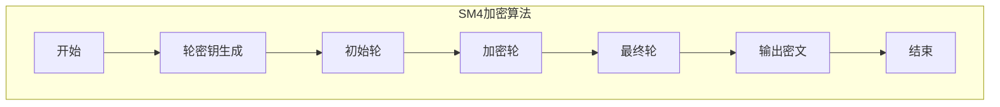
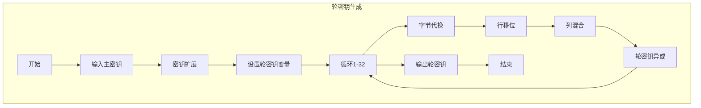
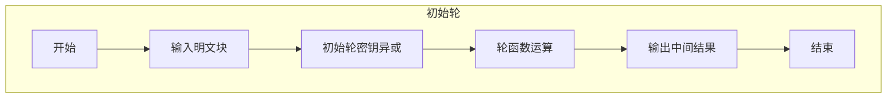
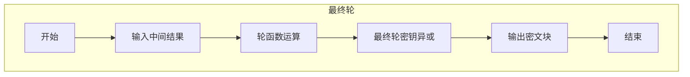
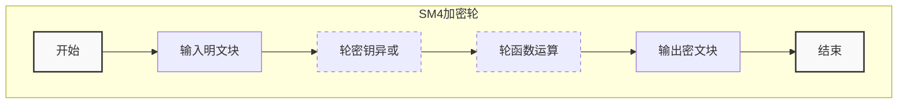
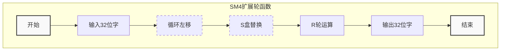
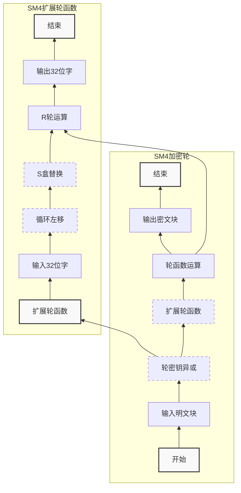

```bash
在上述流程图中，SM4加密算法的主要流程包括以下几个步骤：

轮密钥生成：生成轮密钥用于加密过程。
初始轮：对明文进行初始处理，包括异或轮密钥和置换操作。
加密轮：执行多轮的加密操作，包括字节替代、行移位、列混合和轮密钥的异或操作。
最终轮：执行最后一轮的加密操作，不包括列混合。
输出密文：输出加密后的密文结果。
结束：结束加密算法流程。
请注意，SM4加密算法还涉及到解密过程，该流程图仅展示了加密算法的主要流程。
```



```bash
在上述流程图中，详细展示了SM4加密算法中轮密钥生成的流程。具体流程如下：

输入主密钥：接收输入的主密钥。
密钥扩展：对主密钥进行扩展，生成轮密钥所需的扩展密钥。
设置轮密钥变量：初始化轮密钥的变量，包括轮密钥W和轮常量FK。
循环1-32：进行32轮的密钥生成操作。
字节代换：对轮密钥的一部分进行字节代换操作。
行移位：对轮密钥的一部分进行行移位操作。
列混合：对轮密钥的一部分进行列混合操作。
轮密钥异或：将扩展密钥与轮常量FK进行异或，得到轮密钥的一部分。
输出轮密钥：输出生成的轮密钥。
结束：结束轮密钥生成的流程。
这个流程图更加详细地展示了SM4加密算法中轮密钥生成部分的流程，包括了具体的操作步骤和循环过程。
```



```bash

初始轮的主要流程包括以下几个步骤：

输入明文块：接收输入的明文块。
初始轮密钥异或：将初始轮密钥与明文块进行异或操作。
轮函数运算：使用轮函数对异或结果进行运算。
输出中间结果：输出初始轮的中间结果。
结束：结束初始轮的流程。
最终轮的主要流程包括以下几个步骤：

开始：最终轮的开始节点。
输入中间结果：接收初始轮输出的中间结果。
轮函数运算：使用轮函数对中间结果进行运算。
最终轮密钥异或：将最终轮密钥与轮函数运算结果进行异或操作。
输出密文块：输出加密后的密文块。
结束：结束最终轮的流程。
```


加密轮






