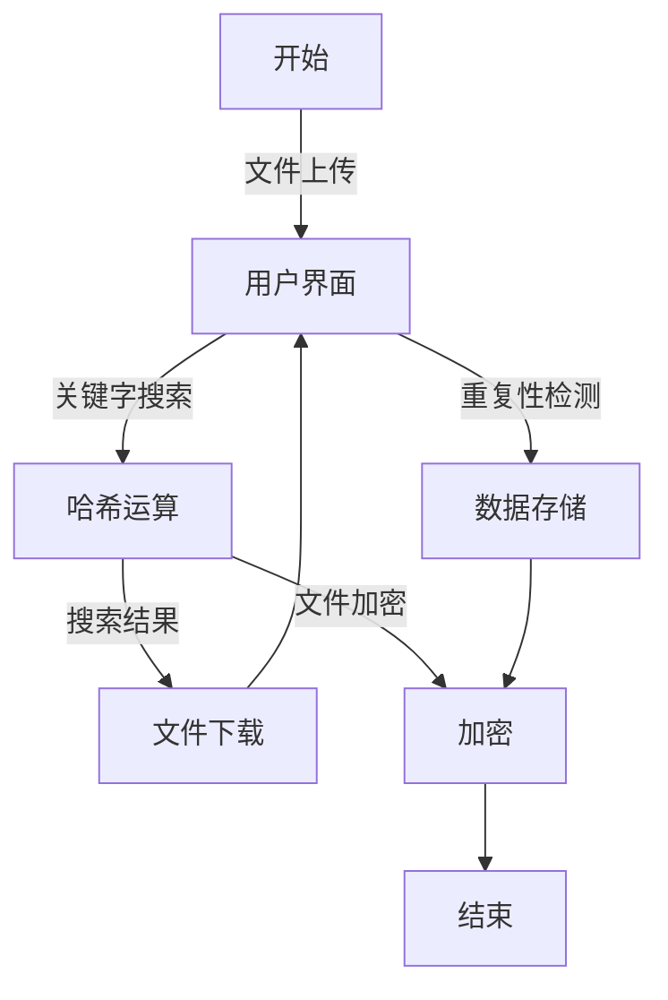
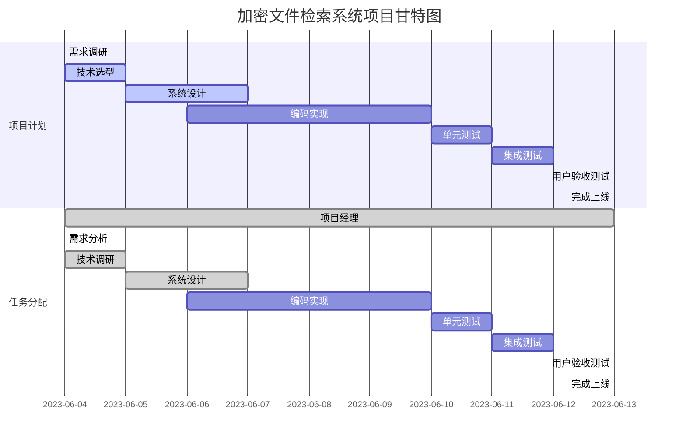

## 程序结构

```mermaid

graph TB
A[开始] -->|文件上传| B[用户界面]
B -->|重复性检测| C[数据存储]
B -->|关键字搜索| D[哈希运算]
D -->|搜索结果| E[文件下载]
D -->|文件加密| F[加密]
C --> F
E --> B
F --> J[结束]

```

## 加密文件检索系统项目甘特图

```mermaid
gantt
    title 加密文件检索系统项目甘特图

    dateFormat  YYYY-MM-DD
    section 项目计划
    需求调研     :active, 2023-06-04, 2023-06-04
    技术选型     :active, 2023-06-04, 2023-06-05
    系统设计     :active, 2023-06-05, 2023-06-07
    编码实现     :2023-06-06, 2023-06-10
    单元测试     :2023-06-10, 2023-06-11
    集成测试 :2023-06-11, 2023-06-12
    用户验收测试 :2023-06-13, 2023-06-13
    完成上线     :2023-06-13, 2023-06-13

    section 任务分配
    项目经理     :done,    des1, 2023-06-04, 2023-06-13
    需求分析     :done,    des2, 2023-06-04, 2023-06-04
    技术调研     :done,    des3, 2023-06-04, 2023-06-05
    系统设计     :done,    des4, 2023-06-05, 2023-06-07
    编码实现     :2023-06-06, 2023-06-10
    单元测试     :2023-06-10, 2023-06-11
    集成测试 :2023-06-11, 2023-06-12
    用户验收测试 :2023-06-13, 2023-06-13
    完成上线     :2023-06-13, 2023-06-13

```